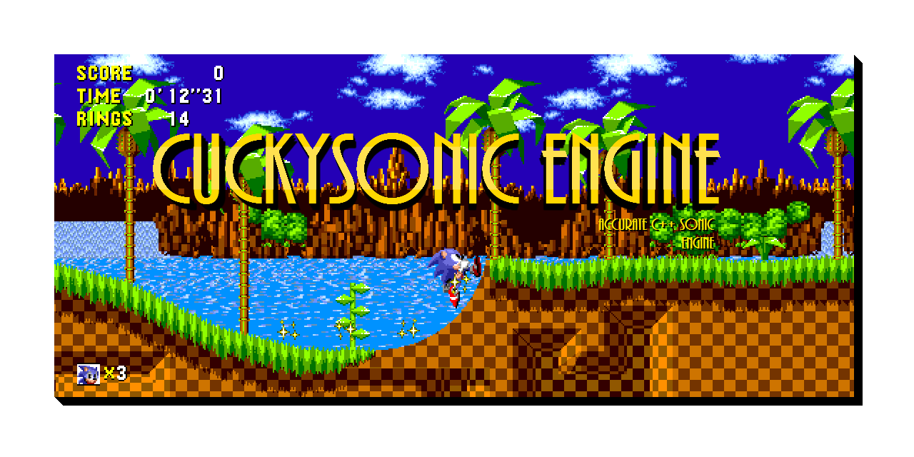

# CuckySonic
An accurate Sonic the Hedgehog engine in C++.

(NOTE: There currently are no development tools, and this is still getting *very* actively worked on, so I wouldn't suggest using this for the time being)

More information can be found in build/Info.txt

## Compiling (Windows - MSYS2)
1. Install MSYS2

2. Install the following packages:

	`base-devel`

	`mingw-w64-x86_64-toolchain`

	`mingw-w64-x86_64-SDL2`

3. Clone the repository (using whichever Git client of your choice)

4. Go into the resulting repository (ex. cd C:/CuckySonic)

5. To build, simply just input `make` with any of the below parameters

`RELEASE=...` if 0, a debug build will be created, if 1, an optimized release build will be created

`STATIC=...` if 1, the .exe will be compiled with all of the required libraries stored internally (preferred on)

`BACKEND=...` This sets which backend to use, the only implemented backend at the moment is SDL2, leaving this blank will probably cause big issues

`WINDOWS=...` This will overwrite the default option for Windows, this is mainly for cross-compilation support

The compiled executable will be in the build folder.

If you have any questions, Google is your friends, but you can always ask on the CuckySonic Discord server
https://discord.gg/XreGMxf
