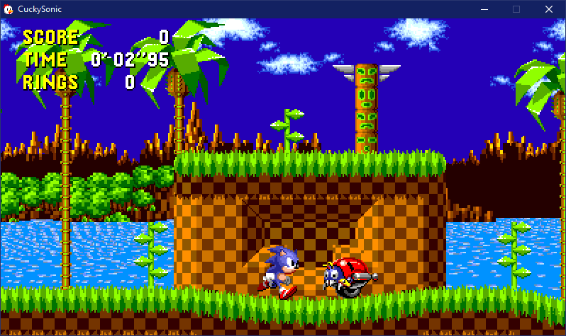

# CuckySonic
An accurate Sonic the Hedgehog engine in C++.
(NOTE: There currently are no development tools, and this is still getting *very* actively worked on, so I wouldn't suggest using this for the time being)

More information can be found in build/Info.txt
